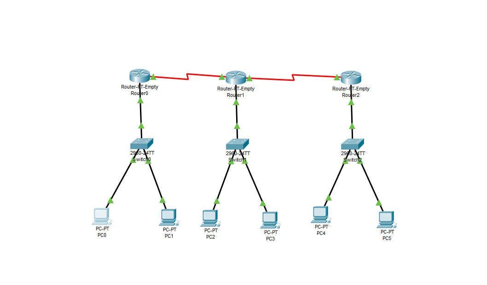

# Computer Networks Practical Test

## Practical 15: Configuring RIPv2 (Classless) Routing in Packet Tracer

### Objective
To configure and verify RIPv2 (Routing Information Protocol version 2) routing on a 3-router network topology using VLSM (Variable Length Subnet Masking) subnets in Cisco Packet Tracer.

---

### 1. Network Topology & Addressing Table

| Device | Interface | IP Address | Subnet Mask | Default Gateway |
| :--- | :--- | :--- | :--- | :--- |
| **R0** | Fa2/0 | 192.168.20.1 | 255.255.255.192 | N/A |
| | Se0/0 | 192.168.20.193 | 255.255.255.252 | N/A |
| **R1** | Fa2/0 | 192.168.20.65 | 255.255.255.192 | N/A |
| | Se1/0 | 192.168.20.194 | 255.255.255.252 | N/A |
| | Se0/0 | 192.168.20.197 | 255.255.255.252 | N/A |
| **R2** | Fa2/0 | 192.168.20.129 | 255.255.255.192 | N/A |
| | Se1/0 | 192.168.20.198 | 255.255.255.252 | N/A |
| **PC0** | Fa0 | 192.168.20.2 | 255.255.255.192 | 192.168.20.1 |
| **PC2** | Fa0 | 192.168.20.70 | 255.255.255.192 | 192.168.20.65 |
| **PC4** | Fa0 | 192.168.20.140 | 255.255.255.192 | 192.168.20.129 |

---

### 2. Topology Diagram


---

### 3. Router Configurations

#### Router R0 Configuration
```text
enable
configure terminal
hostname R0

interface fa2/0
 ip address 192.168.20.1 255.255.255.192
 no shutdown
 exit

interface se0/0
 ip address 192.168.20.193 255.255.255.252
 clock rate 64000
 no shutdown
 exit

router rip
 version 2
 no auto-summary
 network 192.168.20.0
 end
write memory
